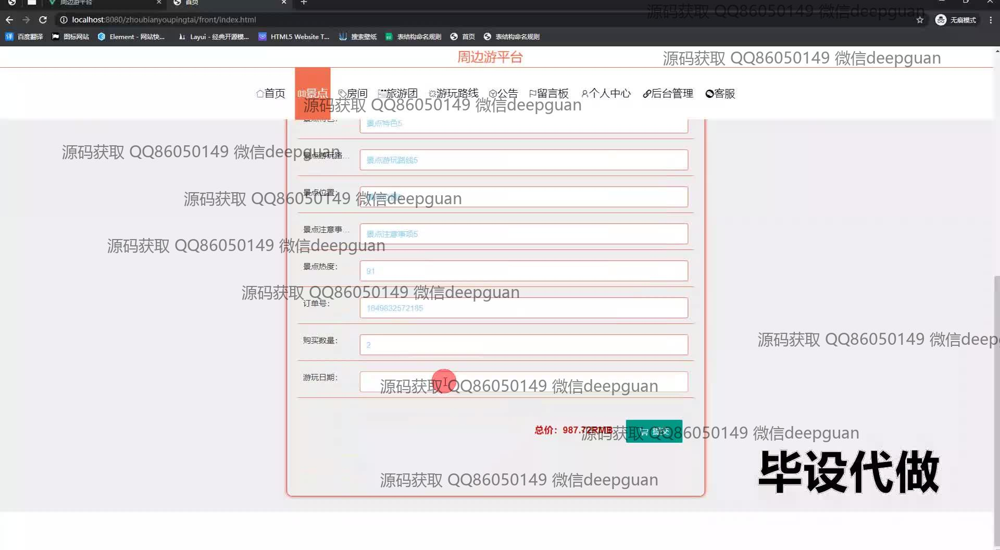
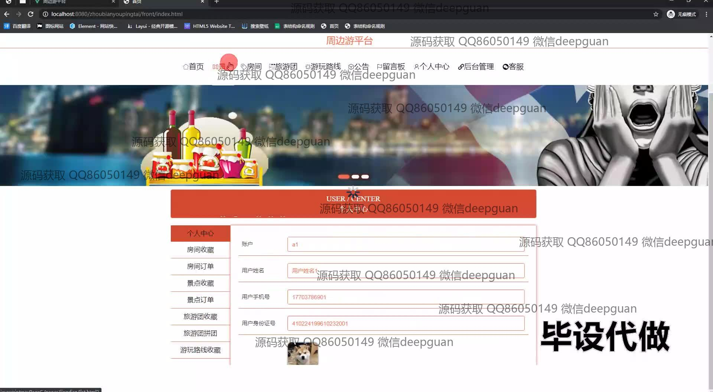

<h1 align="center">基于SpringBoot+Vue的周边游平台个人管理模块的设计与实现</h1>

## 简介
基于SpringBoot和Vue的周边游平台，涵盖用户信息、订单和收藏管理、房间和留言详情、旅游团和景点评价等模块，支持个性化用户设置和高效信息处理，提升管理和用户体验。    --计算机毕业设计源码；毕设源码；java毕业设计源码

## 联系方式

<h3 align="center">获取完整代码与数据库文件 + 微信：deepguan QQ: 86050149 QQ群: 783742310</h3>

<h3 align="center">可帮忙远程部署 包运行成功！提供远程部署、修改代码、设计文档指导、代码讲解等服务！</h3>

## 功能介绍（完整见运行截图）
管理员： 用户管理模块包括用户信息展示、订单和收藏管理，以及安全设置和账号退出功能；房间管理涵盖房间信息查看、购买、及房间评价管理；景点管理包括景点订单和收藏的管理功能；旅游团管理支持旅游团类型的查看和修改；后台管理模块提供对留言、客房评价的搜索、查看、回复和删除等操作，以便高效处理客户反馈和相关数据。

用户： 通过个人管理模块可查看和编辑个人资料，查看和管理旅游订单及收藏信息；用户信息中心显示基本信息如账号、昵称等，支持信息修改和安全设置；房间详情页面提供购买功能及房间信息；景点订单支持评价管理；个人中心模块允许查看和管理个人的旅游计划、留言及评价；同时可以对收藏的景点、旅行团等进行查看和删除。

## 运行截图

本代码来源于网络,仅供学习参考使用!

